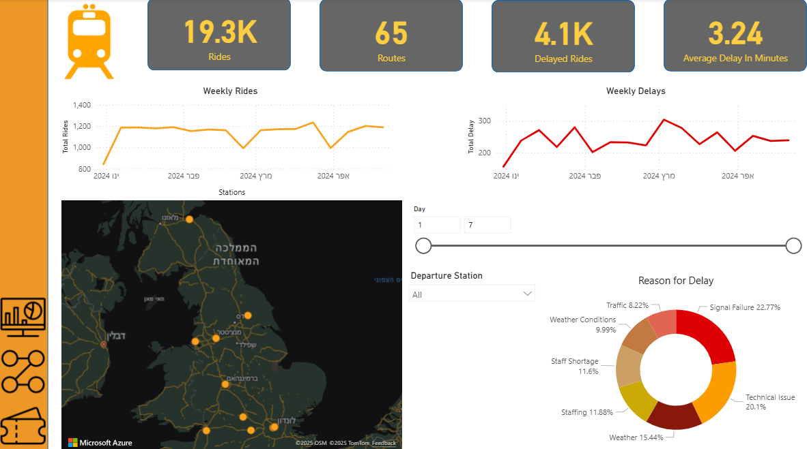

# Train-Analytics-Dashboard
This project presents an interactive Power BI dashboard analyzing train rides, delays,ticket sales and revenues.   The goal is to provide both **operational and business** insights 
# 🚆 Train Analytics Dashboard
---
## 📊 Key Features
- **Executive Dashboard**  
  - Total transactions, revenue, rides, refund rate  
  - Weekly revenue & rides trends  
  - Ticket type distribution (Advance, Off-Peak, Anytime)
  - 
- **Rides Dashboard**  
  - Total rides, delayed rides, average delay  
  - Weekly rides & delays trends  
  - Delay reasons breakdown (traffic, technical issues, staffing, weather, etc.)  
  - Interactive station map

- **Tickets Dashboard**
  - Total transactions, refunds, purchase to journey ratio 
  - Weeklend order trend
  - Transactions distribution by ticket type (Advance, Off-Peak, Anytime) and ticket class (First Class, Standard)

---

## 🛠️ Data Preparation
The project included not only visualization but also **data transformation and enrichment**:
- Added calculated columns (e.g., delay duration, ride routes, weekend days).  
- Created measures for KPIs (e.g., average delay, refund rate, weekly revenue).  
- Cleaned and standardized the dataset for consistent reporting.  

---

## 🖥️ Tools Used
- Power BI  
- DAX & Data Modeling
- Power Query: Data cleaning, transformation, and integration

---

## 💡 Business Insights
From the dashboards, several key insights were observed:
1. **Delays Analysis**  
   - Signal failures (22.7%) and technical issues (20.1%) are the main causes of delays.  
   - Weather conditions contribute significantly (~15%).
   - Average delay of 3.24 minutes is relatively low, but 4.1K affected rides represent significant customer impact 

2. **Rides Trends**  
   - Average weekly rides are stable (~1,100–1,200 rides), but delays fluctuate around 200–300 per week.  
  - Number of routes is stable
3. **Revenue & Ticket Sales**  
   - Strong revenue performance (724K) with healthy transaction volume (30.8K)
   - Off-Peak and Anytime tickets are less popular, signaling opportunity for targeted promotions.  
   - Low refund rate (3.53%) suggests acceptable service quality but room for improvement.
   - Credit card dominance in payments.

4. **Actionable Recommendations**  
   - Priority investment in **signal infrastructure upgrades** to reduce the top cause of delays.  
   - Consider **seasonal staffing adjustments** to handle peak weather-related disruptions.
   - Revenue Protection: Focus on delay reduction to further minimize refunds and improve customer satisfaction
   - Promote **Off-Peak and Anytime tickets** to balance demand and maximize revenue.  

## 📷 Screenshots
  
  
  

---

📌 This project is part of my **Data Analytics portfolio**, showcasing dashboard design, data preparation, and insights generation.

